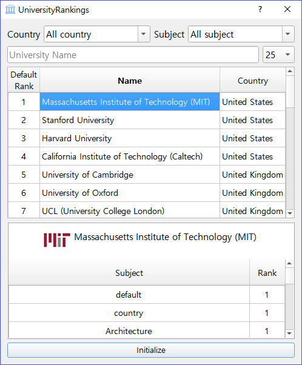

# University Rank Search

It provides the rank information of university in various category. **Default, 
Country** and **Subject.** The data source are taken from the [qs rank site](https://www.topuniversities.com/university-rankings/world-university-rankings/2018).
User can serach the rank of certain university by inputting the university name.
The main algorithm is **Trie** to make search process faster. 

 

## Requirements

data source

- `univ_rank.json` : includes university rank information measured in 2018

package

- `datrie` : Efficient trie library. [link](https://github.com/pytries/datrie)

- `PyQT5`

 

## Run example

You can get below example image after you enter `python ./py_gui.py`.

 
 

## To make .exe file

Run the `build.py` with follwing options

- `python build.py`

> - `--onedir` : Make exe within one directory
> - `--onename` : Make exe in one file
> - `--name NAME` : Name of the output file and directory

If you don't want, you can run following command

- `pyinstaller --windowed --onedir ./py_gui.py` (faster)

- `pyinstaller --windowed --onefile ./py_gui.py`

Then you need to copy src directory to the same directory with exe file

 